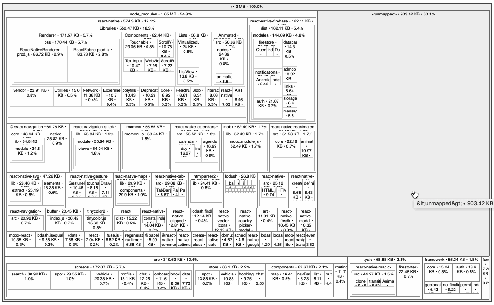

# react-native-bundle-visualizer

See what's inside of your react-native bundle 📦

Uses the awesome [source-map-explorer](https://github.com/danvk/source-map-explorer) to visualize the output of the [Metro bundler](https://github.com/facebook/metro).

## Purpose

Sometimes, importing a single javascript library can drastically increase your bundle size. This package helps you to identify such a library, so you can keep the bundle size low and loading times fast.

## Usage

`npx react-native-bundle-visualizer`

### Or install as a dev-dependency

`yarn add --dev react-native-bundle-visualizer`

And run it:

    yarn run react-native-bundle-visualizer

_or when using npm:_

    npm install --save-dev react-native-bundle-visualizer
    ./node_modules/.bin/react-native-bundle-visualizer

## Command line arguments

All command-line arguments are optional. By default a production build will be created for the `ios` platform.

| Option          | Description                                                   | Example                           |
| --------------- | ------------------------------------------------------------- | --------------------------------- |
| `platform`      | Platform to build (default is **ios**)                        | `--platform android`              |
| `dev`           | Dev or production build (default is **false**)                | `--dev false`                     |
| `entry-file`    | Entry-file (when omitted tries to auto-resolve it)            | `--entry-file ./index.android.js` |
| `bundle-output` | Output bundle-file (default is **tmp**)                       | `--bundle-output ./myapp.bundle`  |
| `verbose`       | Dumps additional output to the console (default is **false**) | `--verbose`                       |
| `reset-cache`   | Removes cached react-native files (default is **false**)      | `--reset-cache`                   |

## Usage with older react-native versions and the Haul bundler

As of `react-native-bundle-visualizer` version 2.x, the direct output of the [Metro bundler](https://github.com/facebook/metro) is visualized using the [source-map-explorer](https://github.com/danvk/source-map-explorer).

Prior to version 2, the Haul bundler was used which used Webpack. If you are having problems visualizing the output for older react-native versions, or you want to explicitly use the Haul bundler, [please check out the V1 documentation](https://github.com/IjzerenHein/react-native-bundle-visualizer/tree/v1).

## License

[MIT](./LICENSE.txt)
